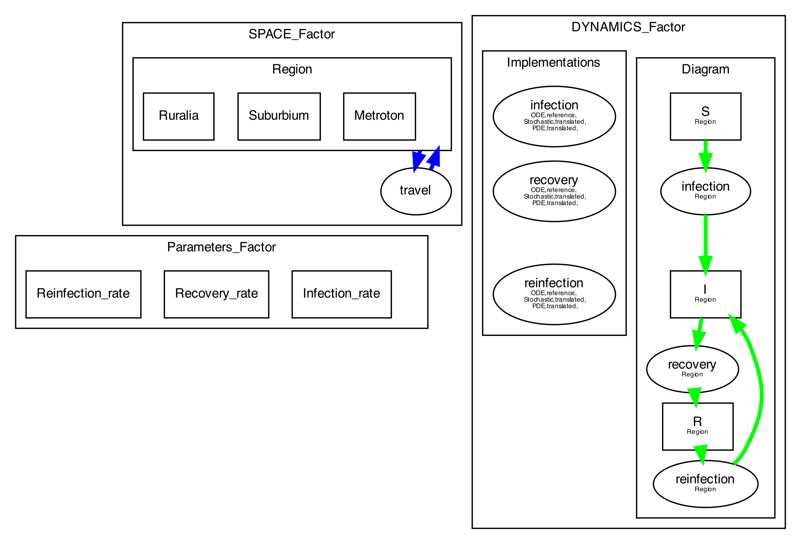
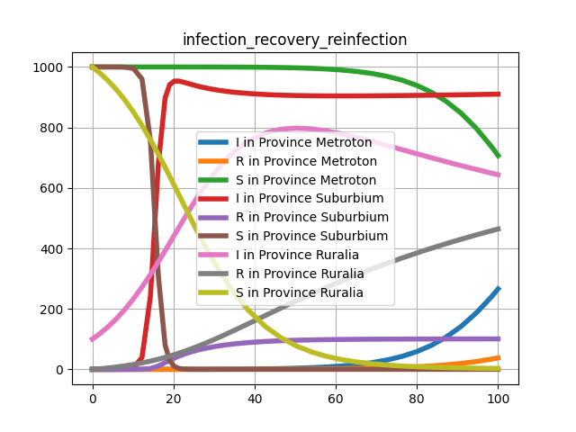
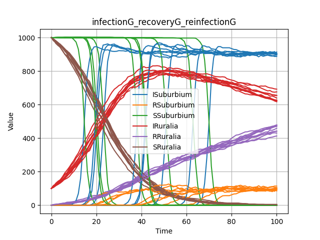

# Facsimile 0.1

# Sample models and Workflows
## SIR Model


### SIR FACTORS

#### Dynamics (`SIRdyn`)
```
{'Processes': [{'implementations': [{'function': <function infection at 0x130a083a0>,
                                     'moc': 'ODE',
                                     'source': 'reference'},
                                    {'function': <function infectionG at 0x130a08550>,
                                     'moc': 'Gillespie',
                                     'source': 'translated'}],
                'indices': ['Region'],
                'name': 'infection'},
               {'implementations': [{'function': <function recovery at 0x130a08430>,
                                     'moc': 'ODE',
                                     'source': 'reference'},
                                    {'function': <function recoveryG at 0x130a085e0>,
                                     'moc': 'Gillespie',
                                     'source': 'translated'}],
                'indices': ['Region'],
                'name': 'recovery'},
               {'implementations': [{'function': <function reinfection at 0x130a084c0>,
                                     'moc': 'ODE',
                                     'source': 'reference'},
                                    {'function': <function reinfectionG at 0x130a08670>,
                                     'moc': 'Gillespie',
                                     'source': 'translated'}],
                'indices': ['Region'],
                'name': 'reinfection'}],
 'Variables': [{'indices': 'Region', 'name': 'S'},
               {'indices': 'Region', 'name': 'I'},
               {'indices': 'Region', 'name': 'R'}]}

```

#### Space (`SIRspace`)
```
{'Advections': {'Region': {'implementation': <function travel at 0x130a08700>,
                           'name': 'Travel'}},
 'Indices': [{'name': 'Region',
              'values': ['Metroton', 'Suburbium', 'Ruralia']}]}
```
#### Parameters (`SIRparameters`)
```
{'Parameters': [{'implementation': <function get_parameters_factor.<locals>.<lambda> at 0x1052a39d0>,
                 'name': 'Infection_rate'},
                {'implementation': <function get_parameters_factor.<locals>.<lambda> at 0x1052b8ee0>,
                 'name': 'Recovery_rate'},
                {'implementation': <function get_parameters_factor.<locals>.<lambda> at 0x154e70f70>,
                 'name': 'Reinfection_rate'}]}
```


## Example Workflows

### ODE based Simulation

#### Workflow

The workflow for ODE based simulation proceeds in the following steps:

1. Assemble space, dynamics and parameters factors into a model suitable for  ODE simulation: `model=F.distribute_to_ode(SIRspace,SIRdyn,SIRparams)`
1. Select initial conditions `y0` and simulation end time `maxt`
1. Attach the model to a Runge Kutta engine: `out = SI.RK45(model,0,y0,maxt)`
1. Simulate and plot the results

#### ODE process implementations

The ODE renderer uses the reference implementation provided for each of the three processes (infection, recovery, reinfection)

```
def infection(t,y,params=[1e-2,1e-3,1e-3]):
    r"""                                                                                          
    Reference implementation for infection                                                        
    as an ODE                                                                                     
                                                                                                  
    :param t: time                                                                                
    :param y: list of current values of S, I, R                                                   
    :param params: list of model paramters                                                        
    :return: list with contributions of infection process to S, I, R derivatives                  
                                                                                                  
    :math:'\frac{dS}{dt}=-\beta I S'                                                              
    :math:'\frac{dI}{dt}=\beta I S'                                                               
    :math:'\frac{dR}{dt}=0'                                                                       
    """
    beta = params[0]
    flow=y[0]*y[1]*beta
    return [-flow,flow,0.0]
    
def recovery(t,y,params=[1e-2,1e-3,1e-3]):
    r"""                                                                                          
    Reference implementation for recovery                                                         
                                                                                                  
    :param t: time                                                                                
    :param y: list of current values of S, I, R                                                   
    :param params: list of model paramters                                                        
    :return: list with contributions of recovery process to S, I, R derivatives                   
                                                                                                  
    :math:'\frac{dS}{dt}=0'                                                                       
    :math:'\frac{dI}{dt}=-\rho I'                                                                 
    :math:'\frac{dR}{dt}=\rho I'                                                                                                                                                         
    """
    rho=params[1]
    flow = y[1]*rho
    return [0.0, -flow,flow]
def reinfection(t,y,params=[1e-2,1e-3,1e-3]):
    r"""                                                                                          
    Reference implementation for recovery                                                         
                                                                                                  
    :param t: time                                                                                
    :param y: list of current values of S, I, R                                                   
    :param params: list of model paramters                                                        
    :return: list with contributions of recovery process to S, I, R derivatives                   
                                                                                                  
    :math:'\frac{dS}{dt}=0'                                                                       
    :math:'\frac{dI}{dt}=\beta I S'                                                               
    :math:'\frac{dR}{dt}=-\beta I R'                                                              
                                                                                                  
    """
    beta = params[2]
    flow=y[1]*y[2]*beta
    return [0.0,flow,-flow]

```
#### Results


### Gillespie algorithm stochastic simulation

#### Workflow
The workflow for stochastic simulation is analogous as ODE:

1. Select initial conditions `y0` and simulation end time `maxt`
1. Assemble space, dynamics and parameters factors into a model suitable for stochastic simulation: `model = F.Distribute_to_gillespie(SIRdyn,SIRspace,SIRparameters,y0,maxt)`
1. Simulate and plot 10 stochastic runs (the gillespie model includes a simulation engine) `    results = model.run(number_of_trajectories=10)`

#### Stochastic process representation

The stochastic model is assembled  from  process implemenations translated from the reference ODE represenation

```
def infectionG(y,params):
    """                                                                                           
    Reference:                                                                                    
    def infection(t,y,params=[1e-2,1e-3,1e-3]):                                                   
       beta = params[0]                                                                           
       flow=y[0]*y[1]*beta                                                                        
       return [-flow,flow,0.0]                                                                    
    :param y:                                                                                     
    :param params:                                                                                
    :return:                                                                                      
    """
    beta=params[0]
    react=dict()
    react['name']='Infection'
    react['rate']=beta
    react['reactants']={y[0]:1,y[1]:1}
    react['products']={y[1]:2}
    return react

def recoveryG(y,params):
    """                                                                                           
    Reference:                                                                                    
    def recovery(t,y,params=[1e-2,1e-3,1e-3]):                                                    
    rho=params[1]                                                                                 
    flow = y[1]*rho                                                                               
    return [0.0, -flow,flow]                                                                      
    :param y:            
        :param params:                                                                                
    :return:                                                                                      
    """
    rho=params[1]
    react=dict()
    react['name']='Recovery'
    react['rate']=rho
    react['reactants']={y[1]:1}
    react['products']={y[2]:1}
    return react

def reinfectionG(y,params):
    """                                                                                           
    Reference:                                                                                    
    def reinfection(t,y,params=[1e-2,1e-3,1e-3]):                                                 
        beta = params[2]                                                                          
        flow=y[1]*y[2]*beta                                                                       
        return [0.0,flow,-flow]                                                                   
    :param y:                                                                                     
    :param params:                                                                                
    :return:       
        """
    beta = params[2]
    react=dict()
    react['name']='Reinfection'
    react['rate']=beta
    react['reactants']={y[1]:1,y[2]:1}
    react['products']={y[1]:2}
    return react
```


#### Results


# Workflow Execution

To execute both simulations:

1. Ensure you have created and activated the conda environment from `environment.yml`
2. Run from the repo folder: `python -m facsimile.demo`


